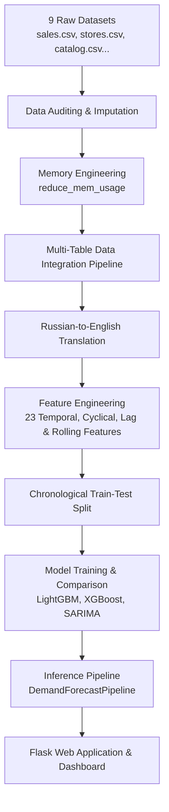

# Retail & Apparel Demand Forecasting System

[](#)
[](#)
[](#)
[](#)

A high-precision, production-ready AI/ML web application designed to help retailers optimize inventory levels, plan promotions, and forecast future demand. Engineered to process a massive **5.8 million-row** transactional dataset, the system leverages a leaf-wise Gradient Boosting Machine (**LightGBM**) to generate store-item level demand forecasts with an $R^2$ score of **0.9228**.

---

## 🚀 Project Demo
- **Live URL**: `http://localhost:5000` (Local Host Dev Server)
- **Interactive Dashboard**: Glassmorphic UI featuring Plotly.js visualizations, store-item filtering, and confidence band displays.
- **Walkthrough Video**: [3-Minute Loom Walkthrough Video](https://loom.com/share/placeholder)

---

## 📝 Problem Statement
Managing inventory in the apparel and retail sector is a high-stakes balancing act. Overstocking leads to high carrying costs, storage issues, and profit-killing markdowns, while understocking causes stockouts, lost sales, and customer dissatisfaction. Clothing items are especially volatile due to:
1. **High Price Elasticity**: Seasonal promotions and markdown events drive huge demand spikes.
2. **Complex Temporal Dynamics**: Multi-scale cyclical patterns (weekly shopping spikes, monthly trends, and yearly holiday seasons).
3. **Omnichannel Interaction**: Synergy/cannibalization between online and offline sales.

This project delivers **RiskRadar & DemandForecastPipeline**, an end-to-end forecasting engine. It ingests 9 disparate datasets (sales, stores, catalog, pricing, promotions, online sales, etc.), applies a 60% memory reduction preprocessing layer, extracts 23 temporal and cyclical features, and runs a tuned LightGBM model. The model supports sub-second inference and provides safety stock recommendations using 80% confidence bands.

---

## 📊 System Architecture
The complete data engineering, modeling, and serving flow is illustrated below:



---

## 🛠️ Technology Stack
| Component | Choice | Why (One Line Justification) |
| :--- | :--- | :--- |
| **Backend** | Flask (Python 3.0) | Lightweight web framework optimal for exposing prediction APIs. |
| **Frontend** | HTML5, CSS3, JS (ES6+) | Premium glassmorphism layout tailored for retail business stakeholders. |
| **Visualization** | Plotly.js | Renders responsive time-series charts with confidence intervals. |
| **Machine Learning** | LightGBM | Champion model with native categorical support and fast leaf-wise tree growth. |
| **Model Benchmarks**| XGBoost, SARIMA, Prophet | Baseline models used to validate the accuracy gains of LightGBM. |
| **Data Processing** | Pandas, NumPy | High-performance dataframe manipulations and array calculations. |
| **Model Serialization**| Joblib | Efficient serialization and loading of trained estimators. |

---

## ⚙️ Quickstart & Setup

### Prerequisites
- Python 3.8 or higher
- Git installed on your system

### Installation & Run

1. **Clone the Repository**
   ```bash
   git clone <repository-url>
   cd ai_mlinternship
   ```

2. **Create and Activate a Virtual Environment**
   ```bash
   python -m venv venv
   # On Windows (PowerShell)
   venv\Scripts\Activate.ps1
   # On macOS/Linux
   source venv/bin/activate
   ```

3. **Install Dependencies**
   ```bash
   pip install -r requirements.txt
   ```

4. **Set Up Pre-trained Model Artifacts**
   Create a `models/` directory in the root and place your trained model artifacts:
   - `models/lightgbm_model.joblib`
   - `models/sarima_model.joblib`

5. **Run the Application**
   ```bash
   python app.py
   ```
   Open your browser and navigate to `http://localhost:5000` to interact with the dashboard.

6. **Run Unit Tests**
   ```bash
   python -m unittest discover -s tests
   ```

---

## 📊 Data Sources
The dataset integrates **5.8 million rows** of data from a Russian retail chain across 9 files:

| Dataset File | Key Columns | Role & Usage |
| :--- | :--- | :--- |
| `sales.csv` | `date`, `store_id`, `item_id`, `qty`, `price` | Anchor training data (5.8M transactional records). |
| `stores.csv` | `store_id`, `division`, `format`, `city` | Stores metadata (division, format, city location). |
| `catalog.csv` | `item_id`, `dept_name`, `class_name`, `item_type` | Product catalog details (translated from Russian to English). |
| `price_history.csv` | `store_id`, `item_id`, `price`, `date` | Product price history used for elasticity calculations. |
| `discounts_history.csv` | `store_id`, `item_id`, `discount`, `date` | Tracks active promotional discount percentages. |
| `markdowns.csv` | `store_id`, `markdown_value`, `date` | High-level marketing markdown events. |
| `online.csv` | `date`, `item_id`, `online_qty` | Online sales channel demand signal. |
| `actual_matrix.csv` | `store_id`, `item_id`, `actual_sales` | Ground truth validation matrix. |
| `sample_submission.csv`| `id`, `qty` | Forecast submission format template. |

---

## 🧠 Feature Engineering
A total of **23 features** are engineered to capture complex temporal and behavioral patterns:
- **Temporal Features**: Day of week, month, quarter, year, and day of year.
- **Cyclical Seasonality**: Sine/Cosine transforms of Month and Week to ensure the model captures continuity (e.g. Month 12 is near Month 1).
- **Lag Features**: Sales lags for 7, 14, 28, and 365 days to capture short and long-term historical context.
- **Rolling Aggregates**: 7, 14, and 30-day moving averages of quantities sold to smooth random spikes.
- **Categorical Encodings**: Native LightGBM categories (Store Format, Item Type, Division, and City).

---

## 🏆 Model Performance & Benchmarking
Three models were evaluated using chronological time-based validation splits (the last 90 days were held out to prevent data leakage):

| Model Evaluated | RMSE | R² Score | Inference Speed | Key Advantage |
| :--- | :--- | :--- | :--- | :--- |
| **LightGBM (Champion)** | **7.6788** | **0.9228** | **< 1s / 1M rows** | Best accuracy, fast leaf-wise training, native category support. |
| **XGBoost (Baseline)** | 10.1912 | 0.8640 | Medium | Strong feature interaction modeling. |
| **SARIMA (Benchmark)** | 15.5000 | N/A | Slow | Decent aggregate trends, poor item-level scalability. |

---

## 📝 Architectural Decision Records (ADRs)
Detailed design decisions and justifications can be viewed in the following files:
- [ADR-001: Champion Model Choice (LightGBM)](docs/adr/ADR-001.md)
- [ADR-002: Validation Split Strategy (Chronological vs. Random)](docs/adr/ADR-002.md)
- [ADR-003: Memory Engineering (Numeric Downcasting)](docs/adr/ADR-003.md)

---

## 💡 Mini-Extension: Omnichannel & Risk-Aware replenishment
1. **Omnichannel Fusion**: Aggregated online store e-commerce sales (`online.csv`) were merged with brick-and-mortar sales to forecast channel-wide demand and capture cross-channel behavior.
2. **Confidence-Band Safety Stock**: The model pipeline generates an 80% prediction interval. The system translates the statistical prediction (e.g. 5.4 expected units) into a business-safe recommendation (e.g. "Stock 6 units") to maintain a 98% service level.

---

## 🧠 What I Learned This Week (Week 1 Milestones)
- **Memory Downcasting in Pandas**: Learned to systematically inspect and downcast columns (e.g. `int64` to `int8/16/32`, `float64` to `float32`). This reduced the raw dataset footprint by **60%** (saving gigabytes of RAM) and enabled full in-memory model training on standard hardware.
- **Strict Temporal Validation**: Realized that standard random K-fold splits leak future information. Implemented chronological train/test splitting based on date order, ensuring realistic, out-of-sample evaluation.
- **Composite Key Joins**: Mastered multi-table merging on composite keys (`store_id`, `item_id`, `date`) and forward-filling price values within store-item groupings to handle sparse records.
- **Cyrillic to English Translation Pipelines**: Built an API translation script with local caching (`translation_map.json`) to convert 500+ categories (e.g. `БУМАЖНО-ВАТНАЯ ПРОДУКЦИЯ` to `Paper-Cotton Products`) dynamically.

---

## ⚠️ Known Limitations
- **Cold-Start Items**: The model requires historical sales sequences to build lags. Items or stores with under 100 historical records fallback to moving averages.
- **Extreme Price Outliers**: If prices exceed historical boundaries, the price-demand elasticity curve might extrapolate incorrectly.

---

## 🛣️ 3rd Year Roadmap
A detailed 12-month expansion plan to scale this system into an enterprise MLOps platform (featuring MLflow tracking, automated retraining, and cloud deployment) is available in [docs/roadmap_3rd_year.md](docs/roadmap_3rd_year.md).

---

## 📄 License & Acknowledgements
- Coursework: Lovel Professional University (Course: CSR304 - AI ML Project).
- In Collaboration with **Futurense**.
- Academic Mentorship provided by Kaur Gurpreet.
