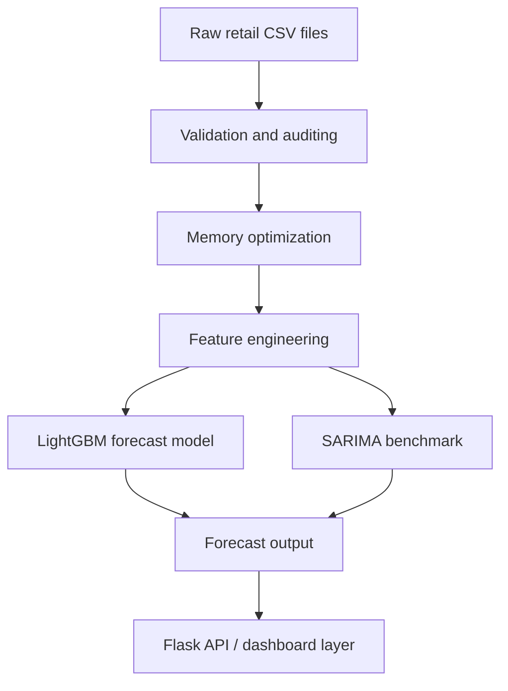

# Retail & Apparel Demand Forecasting System

[]
[]
[]
[]

An ML-focused retail forecasting project for Indian apparel stores, built around demand prediction, data validation, and inventory planning for mid-market brands.

## Project Snapshot

| Field | Value |
| --- | --- |
| Problem code | I1 |
| Segment | Applied Machine Learning / Retail Analytics |
| Author | Kritika Agrahari |
| Current stage | Week 1 foundation and documentation |
| Core model direction | LightGBM with a SARIMA benchmark |
| Main goal | Forecast daily demand so store owners can plan inventory more accurately |

## Problem Statement

Indian apparel retailers deal with irregular festival spikes, regional brand preferences, and highly price-sensitive purchasing patterns. Those factors make inventory planning difficult when decisions are based only on past sales intuition.

This project is intended to turn retail transaction data into a forecasting workflow that supports store-level planning, seasonal stock preparation, and better replenishment decisions. The repository currently contains the design documents and a data-layer validation script that demonstrates ingestion, schema checking, and memory optimization.

## Architecture



## Repository Contents

| Path | Purpose |
| --- | --- |
| [check_data_layer.py](check_data_layer.py) | Validates sample CSV ingestion and applies memory downcasting checks |
| [docs/design_doc.md](docs/design_doc.md) | Initial system design and technical rationale |
| [docs/roadmap_3rd_year.md](docs/roadmap_3rd_year.md) | Personal extension roadmap for the 3rd year portfolio |
| [docs/week_1_submission_issue.md](docs/week_1_submission_issue.md) | Week 1 GitHub Issue template and checklist |
| [03_Deliverables_Specification.md](03_Deliverables_Specification.md) | Official internship deliverables and submission rules |

## Tech Stack

| Layer | Technology | Why |
| --- | --- | --- |
| Data validation | Python, Pandas, NumPy | Simple, reliable ingestion and transformation for tabular CSV data |
| Forecasting | LightGBM | Strong fit for tabular demand forecasting with fast training |
| Benchmarking | SARIMA | Useful baseline for seasonal demand patterns |
| Backend direction | Flask | Lightweight API layer for serving predictions |
| Visualization direction | HTML, CSS, JavaScript, Plotly | Flexible dashboarding without heavy frontend overhead |

## Data Sources

The design assumes the following retail inputs:

| Dataset | Description |
| --- | --- |
| `sales.csv` | Daily item-level sales transactions |
| `stores.csv` | Store location and region data |
| `catalog.csv` | Product and category metadata |
| `price_history.csv` | Price, discount, and offer history |
| `festival_calendar.csv` | Festival and seasonal demand markers |
| `inventory.csv` | Stock and replenishment information |

## What I Learned This Week

- Downcasting numeric columns can significantly reduce memory pressure when working with large CSV files.
- Chronological splits matter for time-series style problems because random splits can leak future information into training.
- Joining multiple retail tables on composite keys needs careful handling of missing dates and incomplete records.
- A simple validation script is useful for proving that the data layer works before the full application is built.
- Clear project documentation is part of the deliverable, not just a nice-to-have.

## Quickstart

### Prerequisites

- Python 3.10 or newer
- `pip`
- Access to the raw retail CSV files expected by `check_data_layer.py`

### Setup

```bash
git clone <repository-url>
cd ai_mlinternship
python -m venv .venv
.venv\Scripts\activate
pip install pandas numpy
```

### Run the data-layer check

```bash
python check_data_layer.py
```

The script prints whether the sample files were found, shows the ingested shape, and reports the memory reduction from downcasting.

## Current Limitations

- The full application code is still being assembled.
- The validation script expects raw CSVs to exist on the local machine.
- The design document is stronger than the implementation at this stage, which is normal for Week 1.

## Related Documentation

- [Week 1 guide](week_1_guide.md)
- [Week 1 submission template](docs/week_1_submission_issue.md)
- [Deliverables specification](03_Deliverables_Specification.md)
- [3rd year roadmap](docs/roadmap_3rd_year.md)

## License

This project is developed for academic and learning purposes.

## Developer

Kritika Agrahari


